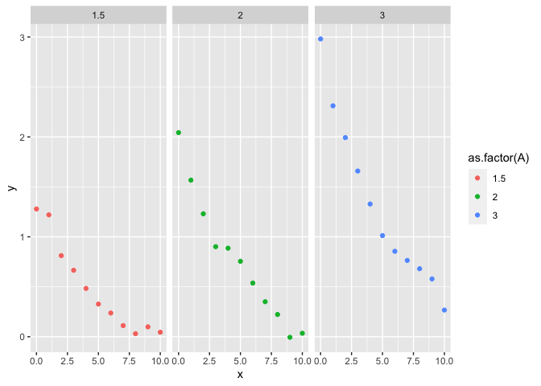
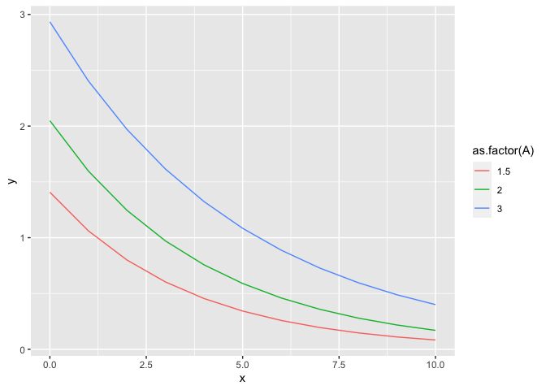
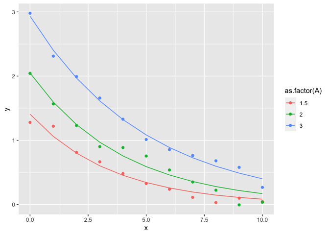

Guide for making multiple fits of similar data
================

``` r
library(tidyverse)
```

This is a rough guide for how I encourage the Zabrenna/Teresa/Ali group
to approach applying the same fit to many different data sets.

Note that the [tidymodels pacakge](https://www.tidymodels.org/) does a
lot of this for you, but I encourage you to do it more “by hand” because
that will help you to better understand what we are doing.

# Define some fake data

``` r
constants <- data.frame(A = c(1.5, 2, 3),
                        k = c(0.3, 0.25, 0.2))
exp_fun <- function(A, k, x = 0:10) {
  y <- A*exp(-1*k*x) + rnorm(n = length(x), 0, 0.1)
  data.frame(x=x, y=y)
}


raw_data <- constants %>%
  mutate(data_to_fit = purrr::map2(A, k, exp_fun)) #%>%
#unnest(data_to_fit)
```

# Look at the raw data

``` r
ggplot(raw_data %>% unnest(data_to_fit), aes(x=x, y=y, colour = as.factor(A))) + 
  geom_point() + 
  facet_wrap(~A)
```

<!-- -->

# Fit each data set to the exponental formula

``` r
# DEfine a function to fit the data
exp.form <- formula(y ~ A * exp(-1*k*x))
fit_exp <- function(df) {
  mod <- nls2::nls2(formula = exp.form, 
             data = df,
             start = list(A = 2, k = 0.25))
  mod
}

# Actually fit the models to the data
fit_data <- raw_data %>%
  mutate(fits = map(data_to_fit, fit_exp))
```

# Extract predictions

``` r
# Write a function to extract predictions

get_preds <- function(mod) {
  grid <- 0:10
  df <- data.frame(x=grid)
  preds <- predict(mod, newdata = df)
  df %>% mutate(y = preds)
}

# Get predictions for each model
preds <- fit_data %>%
  mutate(preds = map(fits, get_preds)) %>%
  unnest(preds)

# Plot the predictions (alone)
ggplot(preds, aes(x=x, y=y, colour = as.factor(A))) + 
  geom_line()
```

<!-- -->

Plot everything together

``` r
ggplot() + 
  geom_line(data = preds, 
            aes(x=x, y=y, colour = as.factor(A))) + 
  geom_point(data = raw_data %>% unnest(data_to_fit),
             aes(x=x, y=y, colour = as.factor(A)))
```

<!-- -->
